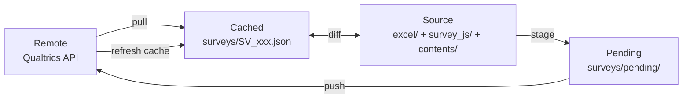

# qsync — Qualtrics survey sync (CLI + Python)

`qsync` helps you treat a Qualtrics survey like a repo: pull it locally, edit in purpose-built files (Excel/JS/HTML), preview + stage changes, then push back safely.

If your team is editing surveys across multiple "surfaces" (copy, logic, translations, shared EOS messages), `qsync` provides one workflow and one workspace to keep it consistent.

## Quick Start

```bash
# Initialize workspace
qsync onboard

# Validate configuration
qsync doctor

# Sync a survey (orchestrates all dimensions)
qsync sync --survey-id SV_xxx
```

> [!TIP]
> `qsync sync` is designed to be the only command most users need day-to-day. It orchestrates items, JS, EOS, and translations workflows automatically.

## When to use qsync

**Use qsync if you want:**

- Repeatable, audit-friendly survey editing workflow (preview → stage → push)
- Excel as the editing surface for wording and translation columns
- Canonical JS files as the editing surface for question logic
- Guardrails around risky edits (publishing, shared library messages, pending state)
- A single command to bring survey state back in sync

**Not a fit when you:**

- Only need one-off API calls (use Qualtrics API directly)
- Prefer editing everything inside the Qualtrics UI

## How it works (mental model)

`qsync` operates on four representations of a survey:



| State | Description | Location |
|---|---|---|
| **Remote** | Live survey in Qualtrics | API |
| **Cached** | Local JSON snapshot | `surveys/SV_*.json` |
| **Source** | Files you edit | `excel/`, `survey_js/`, `contents/` |
| **Pending** | Staged diffs waiting to be pushed | `surveys/pending/` |

> [!IMPORTANT]
> Since 2026-01-24, staging writes to `surveys/pending/` and does not mutate cached survey JSON. Cache refresh happens after successful pushes.

## Installation

Requirements: Python 3.10+ (Python 3.11/3.12 recommended).

### Choose an install method

| You want to... | Recommended method |
|---|---|
| Just run `qsync` commands (most users) | **pipx** (recommended) |
| Import `qsync` as a library in another project | **pip** in that project's venv |
| Develop/contribute to `qsync` | **pip** in editable mode (`-e .`) |
| Use in CI/CD or Docker | **pip** (more predictable) |

### Option A: pipx (recommended for CLI usage)

Install pipx (one-time) and ensure it is on PATH:

```bash
python3 -m pip install --user pipx
pipx ensurepath
# Restart your shell after ensurepath so ~/.local/bin is on PATH
```

Install `qsync` from a GitHub ref (tag, commit SHA, or branch):

```bash
pipx install "qsync @ git+https://github.com/pmmendoza/qsync.git@<git-ref>"
```

macOS note (langcheck): `qsync[langcheck]` uses `fasttext-wheel` when available. On Apple Silicon,
the prebuilt wheel is most reliable on Python 3.11; for Python 3.12+ you typically need to install
`fasttext-wheel` via a source build (C++ compilation). To keep installs reliable, `qsync[langcheck]`
only pulls in `fasttext-wheel` automatically on Python < 3.12. If you want `langcheck`, prefer
Python 3.11:

```bash
pipx install --python /opt/homebrew/opt/python@3.11/bin/python3.11 \
  --include-deps "qsync[completion,pdf,langcheck] @ git+https://github.com/pmmendoza/qsync.git@<git-ref>"
# or set once:
# export PIPX_DEFAULT_PYTHON=/opt/homebrew/opt/python@3.11/bin/python3.11
```

If you do attempt a source build on macOS and see errors like `fatal error: 'istream' file not found`
or `xcrun: error: invalid active developer path`, your Xcode Command Line Tools install is likely
broken/incomplete. Reinstall it:

```bash
sudo rm -rf /Library/Developer/CommandLineTools
xcode-select --install
```

Windows note: pipx installs are supported for the core CLI (CI-smoke-tested). Run
`py -m pipx ensurepath` and restart your shell. PDF export is not supported on Windows yet.

Upgrade or rollback (reinstall with desired ref):

```bash
pipx install --force "qsync @ git+https://github.com/pmmendoza/qsync.git@<git-ref>"
```

Uninstall:

```bash
pipx uninstall qsync
```

### Option B: pip/venv (recommended for dev/library usage)

```bash
python3.11 -m venv .venv
source .venv/bin/activate
pip install "qsync @ git+https://github.com/pmmendoza/qsync.git@<git-ref>"
```

### Optional extras (pipx or pip)

| Extra | What it enables | Notes |
|---|---|---|
| `pdf` | PDF export for translation documents | Uses WeasyPrint (cairo/pango); may require system deps on macOS/Linux (not supported on Windows yet) |
| `completion` | Shell tab-completion via argcomplete | One-time setup: `activate-global-python-argcomplete --user` |
| `langcheck` | Faster language detection via fasttext | Needs `lid.176.ftz` model (see `QSYNC_FASTTEXT_MODEL`). Best on Python 3.11; newer versions typically require a source build. |
| `tui` | **Preview**: Textual-based TUI mode | May be a no-op until the extra is published; safe to include now. |

pipx examples:

```bash
# completion (preferred one-liner)
pipx install --include-deps "qsync[completion] @ git+https://github.com/pmmendoza/qsync.git@<git-ref>"

# multiple extras
pipx install "qsync[pdf,langcheck] @ git+https://github.com/pmmendoza/qsync.git@<git-ref>"
```

pip/venv example:

```bash
pip install "qsync[pdf,completion,langcheck] @ git+https://github.com/pmmendoza/qsync.git@<git-ref>"
```

## Self-update

`qsync` can update itself from GitHub and optionally select extras.

Interactive:

```bash
qsync self-update
```

Non-interactive (extras + pipx):

```bash
qsync self-update --extras tui,langcheck --pipx --yes
```

Dry-run (prints the command):

```bash
qsync self-update --dry-run --extras pdf,langcheck --pip
```

Notes:
- By default, `self-update` auto-detects whether you’re using pipx or pip/venv.
- You can override the repo/ref with environment variables:
  - `QSYNC_UPDATE_REPO` (e.g., `https://github.com/pmmendoza/qsync.git`)
  - `QSYNC_UPDATE_REF` (e.g., `main`, `v0.2.3`, or a commit SHA)

## Configuration

`qsync` reads configuration from (in precedence order):

1. CLI flags: `--root`, `--env-path`
2. Environment variables: `QSYNC_ROOT`, `QSYNC_ENV_PATH`, and Qualtrics credential vars
3. A `.env` file at the workspace root (or an explicit `--env-path`)

### Minimal `.env`

```dotenv
# Host only (no https://)
QUALTRICS_BASE_URL=iad1.qualtrics.com

# Preferred credential key
X-API-TOKEN=...

# Fallback (if needed)
# QUALTRICS_API_KEY=...
```

### Configuration reference

| Key | Required | Example | Notes |
|---|:---:|---|---|
| `QUALTRICS_BASE_URL` | yes | `iad1.qualtrics.com` | Host only, no scheme |
| `X-API-TOKEN` | yes* | `...` | Preferred |
| `QUALTRICS_API_KEY` | yes* | `...` | Fallback if `X-API-TOKEN` not set |
| `QSYNC_ROOT` | no | `/path/to/workspace` | Workspace root (defaults to CWD) |
| `QSYNC_ENV_PATH` | no | `/path/to/.env` | Explicit env file path |
| `QSYNC_FASTTEXT_MODEL` | no | `/path/to/lid.176.ftz` | Used by `translations check-language` |

\* Provide either `X-API-TOKEN` or `QUALTRICS_API_KEY`.

> [!NOTE]
> Qualtrics references:
> - Datacenter ID / host: https://www.qualtrics.com/support/integrations/api-integration/finding-qualtrics-ids/#LocatingtheDatacenterID
> - API token: https://www.qualtrics.com/support/integrations/api-integration/overview/#GeneratingAnAPIToken

## Workspace layout

```text
<workspace>
├── surveys/        # cached JSON, pending staging, inventory artifacts
├── excel/          # workbooks
├── survey_js/      # canonical JS + mapping CSV
├── contents/       # library message HTML + translation artifacts
├── logs/           # audit logs (JSONL)
├── export/         # generated exports
└── responses/      # generated outputs
```

If you run `qsync` outside the workspace, pass `--root` (or set `QSYNC_ROOT`).

## Common workflows

### Edit base-language copy (Excel)

```bash
# 1. Pull latest into Excel
qsync items pull --survey-id SV_xxx

# 2. Edit the workbook, then preview changes
qsync items preview --survey-id SV_xxx

# 3. Stage changes (no cache mutation)
qsync items stage --survey-id SV_xxx --yes

# 4. Push to Qualtrics (refreshes cache after push)
qsync items push --survey-id SV_xxx --force-live
```

> [!NOTE]
> If a staged items push detects Excel changes, it will prompt to restage; use `--use-pending` to push the staged set as-is.

### Edit translations (Excel columns)

```bash
# 1. Add translation columns
qsync items pull --survey-id SV_xxx --languages FR,NL

# 2. Edit translation columns in the workbook, then validate
qsync translations doctor --survey-id SV_xxx --languages FR,NL

# 3. Preview and stage
qsync translations preview --survey-id SV_xxx --languages FR,NL
qsync translations stage --survey-id SV_xxx --languages FR,NL

# 4. Push translations
qsync translations push --survey-id SV_xxx --yes
```

### Edit question JavaScript

```bash
# 1. Update the QID↔JS mapping
qsync js pull --survey-id SV_xxx

# 2. Edit survey_js/core/*.js, then preview
qsync js preview --survey-id SV_xxx --detailed

# 3. Stage and push
qsync js stage --survey-id SV_xxx
qsync js push --survey-id SV_xxx --force-live
```

### Edit EndSurvey (EOS) library messages

```bash
# 1. Pull EOS message(s)
qsync eos pull --survey-id SV_xxx

# 2. Edit contents/qualtrics_library_messages/<LibraryId>/<MessageId>/messages/*.html

# 3. Preview, stage, and push
qsync eos preview --survey-id SV_xxx --detailed
qsync eos stage --survey-id SV_xxx
qsync eos push --survey-id SV_xxx --yes
```

> [!WARNING]
> Shared library messages: Use `qsync eos clone-shared --survey-id SV_xxx --yes` to create survey-specific copies before editing.

### Edit embedded data

```bash
# 1. Pull workbook (creates Embedded_Data sheet)
qsync items pull --survey-id SV_xxx

# 2. Edit Value column in Embedded_Data sheet

# 3. Preview and push (same as items workflow)
qsync items preview --survey-id SV_xxx --embedded-data-only
qsync items stage --survey-id SV_xxx --embedded-data-only --yes
qsync items push --survey-id SV_xxx --force-live
```

### Bulk survey metadata/status (Survey Master)

```bash
# 1. Pull snapshots and generate master CSV
qsync survey master pull

# 2. Edit surveys/qualtrics_master.csv

# 3. Preview and apply changes
qsync survey master preview
qsync survey master apply
```

## Feature highlight: Translation export

Generate detailed documentation for translators or compliance reviews. Outputs include flow diagrams, logic branches, question text, and JavaScript string extraction.

```bash
# Default DOCX export
qsync survey export-translation --survey-id SV_xxx

# PDF format with improved HTML rendering
qsync survey export-translation --survey-id SV_xxx --format pdf

# Generate both formats in one run
qsync survey export-translation --survey-id SV_xxx --format both

# Bilingual review mode (EN + target language side-by-side)
qsync survey export-translation --survey-id SV_xxx --language FR --compare-to-base

# Batch export multiple languages
qsync survey export-translation --survey-id SV_xxx --languages FR,NL,CS
```

**Recent improvements** (2026-01-21):
- **JS string extraction**: Automatically extracts user-visible strings from JavaScript with intelligent filtering
- **Meta question formatting**: Compact display for Browser metadata and Timing questions
- **Comprehensive filtering**: Removes debug/logging noise, CSS selectors, technical prefixes

## Safety notes

> [!WARNING]
> - Staging writes to `surveys/pending/` (cache refresh happens after push).
> - Be careful editing shared library messages; prefer clone + rewire.
> - For automation: always set a pending action explicitly when using `--yes`.
> - Some operations affect live data (publishing, shared resources).

## Troubleshooting

Start with:

```bash
qsync doctor
```

**Common issues:**

| Issue | Solution |
|---|---|
| Base URL error | Must be host-only (e.g., `iad1.qualtrics.com`), no `https://` |
| Missing/invalid token | Check `X-API-TOKEN` or `QUALTRICS_API_KEY` in `.env` |
| Wrong workspace root | Use `--root` flag or set `QSYNC_ROOT` environment variable |

**Script-friendly diagnostics:**

```bash
qsync doctor --json
```

## Logging

Audit logs are written as JSONL under the workspace root:

- Default: `logs/qualtrics_push.log`
- Disable: `QSYNC_LOG_DISABLED=1` (legacy: `NEWSFLOWS_LOG_DISABLED=1`)
- Redirect: `QSYNC_LOG_DIR=/path/to/logs` (legacy: `NEWSFLOWS_LOG_DIR=/path/to/logs`)

## Documentation

- [Docs index](docs/index.md)
- Workflows: [Items](docs/workflows/items.md), [JavaScript](docs/workflows/js.md), [Translations](docs/workflows/translations.md), [Survey Master](docs/workflows/survey-master.md)
- References: [Excel format](docs/reference/excel-format.md), [Push safeguards](docs/reference/push-safeguards.md), [Publishing mechanics](docs/reference/publishing-mechanics.md)
- [Translation export](docs/features/translation-export.md)
- [Troubleshooting](docs/troubleshooting.md)

## CLI reference

```bash
qsync --help
qsync sync --help
qsync survey --help
qsync items --help
qsync js --help
qsync eos --help
qsync translations --help
```

Full CLI reference: [docs/reference/cli.md](docs/reference/cli.md)

## Contributing

Contributions are welcome! Please:

1. Fork the repository
2. Create a feature branch
3. Make your changes
4. Submit a pull request

## Security

> [!CAUTION]
> - **Never commit `.env` files** containing API tokens to version control
> - Add `.env` to your `.gitignore`
> - Rotate API tokens if accidentally exposed
> - Use workspace-level `.env` files, not user-level shell profiles for production

## License

[LICENSE](LICENSE)

## Support

- Issues: [GitHub Issues](https://github.com/pmmendoza/qsync/issues)
- Documentation: [docs/index.md](docs/index.md)
- Troubleshooting: [docs/troubleshooting.md](docs/troubleshooting.md)
