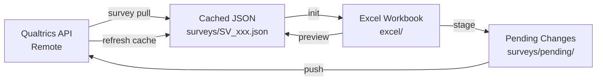
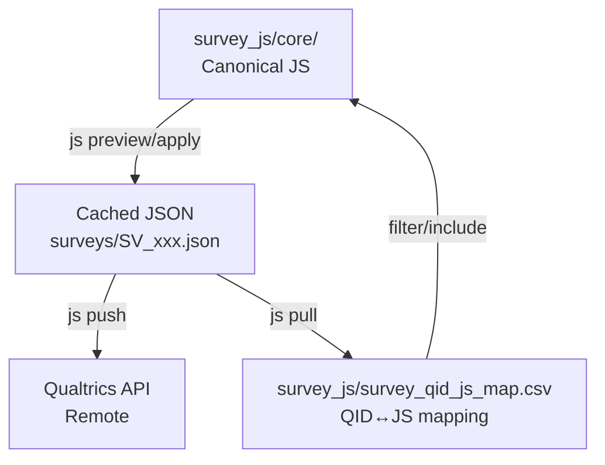

# qsync: Qualtrics survey sync CLI

`qsync` is a CLI + Python library for syncing Qualtrics surveys with local editing surfaces (Excel for wording, JavaScript files for logic) and related workflows (translations, EOS library messages, and bulk Survey Master edits).

This package originated in an internal monorepo; this repository’s goal is to make it work out-of-the-box for a standalone workspace.

## Installation

```bash
pip install qsync

# Optional extras
pip install "qsync[pdf]"          # PDF export support (WeasyPrint)
pip install "qsync[completion]"   # Shell completion support
```

## Quick Start

Before doing anything else, validate your workspace + credentials:

```bash
qsync doctor
```

## Workspace configuration

`qsync` reads configuration from (in precedence order):

1. CLI flags: `--root`, `--env-path`
2. Environment variables: `QSYNC_ROOT` and the normal Qualtrics credentials vars
3. A `.env` file located at the workspace root (or an explicit `--env-path`)

### Required `.env` keys

At minimum:

- `QUALTRICS_BASE_URL`: host only (example: `iad1.qualtrics.com`, not `https://...`)
- `X-API-TOKEN` (preferred) or `QUALTRICS_API_KEY` (fallback)

### Workspace folders (MVP expectations)

By default, `qsync` expects these directories under your workspace root:

- `surveys/` (cached JSON, pending staging, inventory)
- `excel/` (workbooks)
- `survey_js/` (JS core + mapping CSV)
- `contents/` (library message content, translation content artifacts)
- `logs/`, `export/`, `responses/` (generated outputs)

If you run `qsync` outside the workspace, pass `--root` (or set `QSYNC_ROOT`).

Typical “items” (Excel wording) workflow:

```bash
# 0) Update inventory (recommended)
qsync survey inventory

# 1) Initialize (or refresh) the Excel workbook from the cached survey
qsync items pull --survey-id SV_xxx

# 2) Preview diffs (no writes)
qsync items preview --survey-id SV_xxx

# 3) Stage changes into pending (no cache mutation)
qsync items stage --survey-id SV_xxx --yes

# 4) Push staged changes to Qualtrics (refreshes cache after push)
qsync items push --survey-id SV_xxx --force-live
```

Typical "js" (Question JavaScript) workflow:

```bash
# 0) Ensure the local cache is fresh (recommended)
qsync survey pull --survey-id SV_xxx

# 1) Update the QID↔JS mapping for the survey
qsync js pull --survey-id SV_xxx

# 2) Preview diffs
qsync js preview --survey-id SV_xxx --detailed

# 3) Stage JS changes (no cache mutation)
qsync js stage --survey-id SV_xxx

# 4) Push updated JS blocks to Qualtrics (refreshes cache after push)
qsync js push --survey-id SV_xxx --force-live
```

Typical "eos" (EndSurvey library message) workflow:

```bash
# 0) Ensure the local survey cache is present (pull downloads if missing)
qsync survey pull --survey-id SV_xxx

# 1) Pull EOS library message(s) referenced by SurveyFlow EndSurvey nodes
qsync eos pull --survey-id SV_xxx

# 2) Edit the local message HTML under:
#   contents/qualtrics_library_messages/<LibraryId>/<MessageId>/messages/*.html

# 3) Preview diffs vs live API
qsync eos preview --survey-id SV_xxx --detailed

# 4) Stage changes (no API calls)
qsync eos stage --survey-id SV_xxx

# 5) Push staged changes (API calls; requires --yes)
qsync eos push --survey-id SV_xxx --yes
```

Shared-message safety:
- `qsync eos pull/preview` will warn if the EOS message is referenced by multiple cached surveys (local scan only).
- `qsync eos apply/push` will hard-stop unless `--allow-shared-message-edit` is provided (and confirmed, unless `--yes`).
- Smoke-safe option: `qsync eos clone-shared --survey-id SV_xxx --yes` clones shared EOS library messages and rewires the survey to reference survey-specific copies.

Repair:
- `qsync eos repair --survey-id SV_xxx` re-fetches EOS message content and rewrites local files (useful if local files drift).

Translations workflow (non-base languages):

**Migration note (2026-01-24):** Translation map JSON workflows and the legacy
`qsync survey translations ...` entry point are removed. Use the workbook-based
`qsync translations ...` flow.

**Migration note (2026-01-26):** `qsync js stage` and `qsync eos stage` no longer
mutate cached survey JSON; they only write pending changes. Cache refresh now
happens after a successful push.

```bash
# 0) Enable languages (if needed)
qsync translations languages ensure --survey-id SV_xxx --language FR --language NL

# (Optional) Replace enabled languages explicitly
qsync translations languages set --survey-id SV_xxx --languages EN,FR,NL

# 1) Create/update workbook translation columns
qsync items pull --survey-id SV_xxx --languages FR,NL

# 2) Edit translation columns in the workbook (Questions/Options/Subitems/Survey_Metadata)

# 3) Preview changes
qsync translations preview --survey-id SV_xxx --languages FR,NL

# 4) Stage changes
qsync translations stage --survey-id SV_xxx --languages FR,NL

# 5) Validate
qsync translations doctor --survey-id SV_xxx --languages FR,NL

# 6) Push to Qualtrics
qsync translations push --survey-id SV_xxx --yes
```

Notes:
- The translations workflow targets non-base languages. Use the items workflow for base-language edits.
- If a staged translations push detects Excel changes, it will prompt to restage; use `--use-pending` to push the staged set as-is.
- See `docs/workflows/translations.md` for the full workflow and guardrails.

Sync orchestrator (multi-dimension):

```bash
qsync sync --survey-id SV_xxx

# Automation note: when running with --yes and staged pending exists, you must pick a pending action.
qsync sync --survey-id SV_xxx --yes --pending-action push --force-live
```

**Migration note (2026-01-26):** `qsync sync --yes` defaults to `--pending-action abort` when pending exists; use `--pending-action push` (or `discard`) for automation.

Translations + Excel workbook integration:

```bash
# Add translation columns during init
qsync items pull --survey-id SV_xxx --languages FR,NL

# Validate workbook content (placeholders, HTML hazards, coverage)
qsync translations doctor --survey-id SV_xxx --languages FR,NL --workbook excel/...xlsx
```

Translation pack export (docx + cached translations):

```bash
qsync translations pack --survey-id SV_xxx --languages FR,NL
```

Embedded data workflow (integrated with items workflow):

```bash
# Embedded data fields are automatically included in the standard workflow:

# 1) Initialize Excel workbook (creates Embedded_Data sheet)
qsync items pull --survey-id SV_xxx

# 2) Edit the Value column in the Embedded_Data sheet

# 3) Preview changes (shows both items and embedded data diffs)
qsync items preview --survey-id SV_xxx

# 4) Apply changes to cache
qsync items stage --survey-id SV_xxx --yes

# 5) Push to Qualtrics (pushes both items and SurveyFlow)
qsync items push --survey-id SV_xxx --force-live

# Optional: Preview/apply only embedded data changes
qsync items preview --survey-id SV_xxx --embedded-data-only
qsync items stage --survey-id SV_xxx --embedded-data-only --yes

# Optional: Edit fields without default values (requires flag)
qsync items stage --survey-id SV_xxx --allow-dangerous --yes
```

Survey Master (bulk metadata/options/status) workflow:

```bash
# 1) Pull snapshots and generate the master CSV
qsync survey master pull

# 2) Edit surveys/qualtrics_master.csv

# 3) Preview changes
qsync survey master preview

# 4) Apply changes (use --allow-dangerous for sensitive fields)
qsync survey master apply
```

## Workspace root (running outside the workspace)

By default, `qsync` operates on the current repo as its workspace root. When running outside this repo, set the workspace explicitly:

```bash
export QSYNC_ROOT="/path/to/qualtrics-workspace"
export QSYNC_ENV_PATH="/path/to/qualtrics-workspace/.env"

qsync doctor
```

Both `--root` and `--env-path` can be supplied before or after subcommands:

```bash
qsync --root /path/to/qualtrics-workspace --env-path /path/to/qualtrics-workspace/.env doctor
qsync doctor --root /path/to/qualtrics-workspace --env-path /path/to/qualtrics-workspace/.env
```

## Logging

`qsync` writes JSONL audit logs to `logs/qualtrics_push.log` under the workspace root.

Overrides:

- Disable: `QSYNC_LOG_DISABLED=1` (legacy: `NEWSFLOWS_LOG_DISABLED=1`)
- Redirect: `QSYNC_LOG_DIR=/path/to/logs` (legacy: `NEWSFLOWS_LOG_DIR=/path/to/logs`)

## Architecture

The system operates on three representations of a survey:

1.  **Remote**: The live survey on Qualtrics (accessed via API).
2.  **Cached**: A local JSON definition (`surveys/SV_xxx.json`).
3.  **Source**:
    - **Excel** (`excel/*.xlsx`) for question text and choices.
    - **JavaScript** (`survey_js/core/*.js`) for question logic.

The workflow is: `Remote` -> (pull) -> `Cached` <-> (diff) <-> `Source` -> (stage to pending) -> (push) -> `Remote` -> (refresh cache) -> `Cached`.

**Migration note (2026-01-24):** staging now writes pending records under `surveys/pending/` and does **not** mutate cached survey JSON; caches are refreshed after successful pushes.

### Three-tier Sync Diagram



### JavaScript Sync Diagram



## CLI Usage

The package exposes a CLI via the `qsync` console script (installed with the package).

```bash
# General help
qsync --help

# Survey management
qsync survey inventory
qsync survey pull --survey-id SV_xxx
qsync survey activate --survey-id SV_xxx --yes
qsync survey deactivate --survey-id SV_xxx --yes
qsync survey label --survey-id SV_xxx
qsync survey focal
qsync survey inspect-question --survey-id SV_xxx --question-id QID1
qsync survey export-translation --survey-id SV_xxx

# Note: `survey label` / `survey focal` rely on surveys/qualtrics_surveys.csv (run `qsync survey inventory` first).
# Note: activate/deactivate updates the API only; run `qsync survey master pull` to sync the master CSV.

# Script-friendly doctor output
qsync doctor --json
```

### Survey Commands

#### `qsync survey export-translation` (Document export for translation validation)

Exports a document that visualizes SurveyFlow order, question text (with best-effort formatting), choices/subitems, and key translation-relevant metadata. Supports both Word (`.docx`) and PDF (`.pdf`) formats. Also writes Mermaid artifacts alongside the document.

**Recent improvements** (2026-01-21):
- **JS string extraction**: Automatically extracts user-visible strings from JavaScript with intelligent filtering (removes debug/logging noise, ~29% reduction)
- **Meta question formatting**: Meta questions (e.g., Browser metadata) display compactly like Timing questions
- **Comprehensive filtering**: Removes string concatenation artifacts, technical prefixes, CSS selectors, variable assignments

**Format Options** (`--format docx|pdf|both`):
- `docx` (default): Word document, editable format ideal for translators
- `pdf`: PDF document with native HTML rendering, ideal for review/archival
- `both`: Generate both DOCX and PDF in a single run

**JavaScript String Extraction**:
- Enabled by default for questions with JavaScript (inline or external)
- Prioritizes COPY object patterns (internationalization dictionaries)
- Filters out: debug messages, technical prefixes, CSS selectors, string concatenation artifacts
- Disable with: `--skip-js-strings`

Outputs (default):
- `export/<SurveyName>__<SurveyID>__translation.docx` or `.pdf`
- `export/<SurveyName>__<SurveyID>__translation.flow.mmd`
- `export/<SurveyName>__<SurveyID>__translation.flow.png` (rendered Mermaid image; can require network access)

When exporting a specific translation language, outputs are suffixed:
- `export/<SurveyName>__<SurveyID>__translation__FR.docx` (single-language)
- `export/<SurveyName>__<SurveyID>__translation__EN-FR.docx` (bilingual `--compare-to-base`)

**Note**: PDF export requires WeasyPrint. If not installed, run:
```bash
pip install "weasyprint>=62.0"
# On macOS, you may also need system libraries:
brew install cairo pango gdk-pixbuf libffi
```

Examples:

```bash
# Default export (writes to export/)
qsync survey export-translation --survey-id SV_xxx

# PDF export with improved HTML rendering fidelity
qsync survey export-translation --survey-id SV_xxx --format pdf

# Generate both formats in one run
qsync survey export-translation --survey-id SV_xxx --format both

# Disable JS string extraction
qsync survey export-translation --survey-id SV_xxx --skip-js-strings

# Render using cached translations (participant view)
qsync survey export-translation --survey-id SV_xxx --language FR

# Batch export multiple languages (one .docx per language)
qsync survey export-translation --survey-id SV_xxx --languages FR,NL,CS

# Bilingual review mode (EN + target rendered together)
qsync survey export-translation --survey-id SV_xxx --language FR --compare-to-base

# Enable layout heuristics (reviewer-friendly transforms; default is UI-faithful)
qsync survey export-translation --survey-id SV_xxx --language FR --compare-to-base --layout-heuristics

# Refresh cached survey definition from Qualtrics before exporting (network)
qsync survey export-translation --survey-id SV_xxx --language FR --refresh

# Scenario export: prune provably-irrelevant SurveyFlow branches based on explicit EDFs
qsync survey export-translation --survey-id SV_xxx --edf S_VERSION=PROLIFIC --edf DEBUG=F

# Omit HTML source blocks when a parsed rendering exists
qsync survey export-translation --survey-id SV_xxx --no-html

# Disable Mermaid rendering (keeps .mmd, skips .png rendering/embed)
QSYNC_MERMAID_RENDER=0 qsync survey export-translation --survey-id SV_xxx

# Avoid overwriting previous exports
qsync survey export-translation --survey-id SV_xxx --smart-name

# Open after generation (system-dependent)
qsync survey export-translation --survey-id SV_xxx --open

# PDF export (better HTML rendering fidelity)
qsync survey export-translation --survey-id SV_xxx --format pdf

# Generate both DOCX and PDF
qsync survey export-translation --survey-id SV_xxx --format both

# PDF export with translation language
qsync survey export-translation --survey-id SV_xxx --language FR --format pdf

# Multiple languages + both formats (generates 4 files: FR.docx, FR.pdf, NL.docx, NL.pdf)
qsync survey export-translation --survey-id SV_xxx --languages FR,NL --format both
```

Notes:
- `--output` can be a `.docx` file path or a directory; default is `export/`.
- `--edf KEY=VALUE` is repeatable and affects both branch pruning and how the scenario is presented in the document (the export represents the requested scenario, not all possible runtime paths).
- `--language/--languages` overlays user-facing copy from the cached survey definition (refresh with `--refresh` if missing).
- When exporting with a language, the document header’s survey link includes `Q_Language=<LANG>` (and still includes `--edf` params if provided).
- In bilingual mode (`--compare-to-base`), question text/options are shown in a two-column EN vs target side-by-side layout (shared metadata + logic rows).
- By default, HTML layout is UI-faithful (e.g., `<ul>/<li>` stays lists). Use `--layout-heuristics` to enable reviewer-friendly transforms (may diverge from Qualtrics UI).

How to read the export (high level):

- **Typography defaults**: body text is explicitly set to Arial 10pt, with paragraph spacing after (no default “space before”).
- **Block headers**: each block begins with a highlighted `BLOCK START: … (BL_xxx)` line; block headers have extra spacing both before and after (no forced page breaks).
- **Question blocks**: each question is rendered as a compact table (stacked rows). The first row is a metadata line:

  `[{QID}][{QT}][JS] {ET} {VALIDATION}`

  - `QID`: Qualtrics question id (monospace, 11pt)
  - `QT`: abbreviated question type (legend is included near the top; randomized questions use `+R`, e.g. `MC+R`)
  - `[JS]`: present when QuestionJS exists or a JS file is mapped via `survey_js/survey_qid_js_map.csv`
  - `ET`: `DataExportTag` (from here on, the run font is explicitly Arial)
  - `VALIDATION`: `*` for force response, `+` for request response, empty otherwise
- **Logic blocks**: `BRANCH:` / `DISPLAY IF:` lines are shown in monospace 8pt with a light background and token highlighting:
  - `QIDxx:"…"` (question reference) is shown in black
  - `A:"…"` (answer reference) is shown in blue
  - `EDF:…` is shown in green
  - operators are emphasized in red
- **Embedded Data writes**: `EmbeddedData` SurveyFlow nodes render as small “EMBEDDED DATA WRITES” tables (header row bold) with fixed column widths (Field/Value wider; Type/FlowID narrower). `${e://Field/...}` tokens are highlighted in monospace green across the document.
- **WebService nodes**: `WebService` SurveyFlow nodes render as a single “WEB SERVICE” table (“card”) with core fields (method/URL/content type) plus structured sections for request params, headers, body, and response mappings.
- **EndSurvey message content**: `EndSurvey(DisplayMessage)` nodes embed local library message HTML when present under `contents/qualtrics_library_messages/...` (run `qsync eos pull --survey-id SV_xxx` to fetch). If message content is not present locally, the export leaves an explicit note.

Scenario export (`--edf`) semantics:

- Branch pruning is best-effort and conservative: if a branch condition cannot be decided from the provided EDF values, both paths remain in the export.
- If a branch condition becomes decidable, the export renders only the taken path and omits the `BRANCH:` / `THEN:` / `ELSE:` / `END BRANCH` annotation lines for that branch (the document becomes scenario-specific).
- Additional “flow-order” heuristic: for some OR conditions, the exporter treats `Question is Selected` as **false** when the referenced question has not been asked yet in the reachable flow order under the current EDF pruning. This helps decide branches that would otherwise remain ambiguous.
- Question-level `DisplayLogic` is also evaluated when it references EmbeddedFields that are provided via `--edf` (conservative: if the logic cannot be decided, the question is kept).
- Blocks that become empty after scenario pruning / DisplayLogic evaluation are omitted from the export.

FAQ:
- **Why do I still see Raw HTML?** Some Qualtrics content uses complex/interactive HTML. `qsync` renders safe formatting where possible and falls back to a readable placeholder; use `--no-html` to drop source blocks when a parsed version exists.
- **Why did Mermaid rendering fail?** Mermaid rendering can require network access; set `QSYNC_MERMAID_RENDER=0` to disable rendering while still writing the `.mmd` source.

See `docs/features/translation-export.md` for the full formatting/semantics reference (including current limitations and implementation notes).

See `docs/index.md` for workflows and references.

## Programmatic Usage

Most usage goes through the CLI, but `qsync` can also be used as a Python library:

```python
from qsync.config import get_client_config
from qsync.markdown_codec import html_to_md, md_to_html

base_url, headers = get_client_config()
print("Qualtrics base URL:", base_url)
print(html_to_md("<p>Hello <strong>world</strong></p>"))
print(md_to_html("Hello **world**"))
```

## Package Structure

- **`cli.py`**: Main entry point and CLI argument parsing.
- **`sync_core.py`**: Logic for comparing and merging Excel data with cached JSON.
- **`qualtrics_client.py`**: Low-level API client and JSON cache management.
- **`excel_io.py`**: Reading/writing Excel files (using `openpyxl`).
- **`push_policy.py`**: Safety checks (locking, live response detection).
- **`js_*.py`**: Modules handling the JavaScript sync pipeline.

## Documentation

- **Formatting Rules**: See `docs/reference/excel-format.md` for Excel conventions.
- **Workflows**: See `docs/workflows/items.md`, `docs/workflows/js.md`, `docs/workflows/translations.md`, and `docs/workflows/survey-master.md`.
- **Translation export**: See `docs/features/translation-export.md` for the export formatting guide + scenario semantics.
- **Survey Master Fields**: See `docs/reference/survey-master-fields.md`.

## Troubleshooting

Start here:

- See `docs/troubleshooting.md`.
